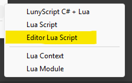

[](https://lunyscript.com)

# Luny: Lua in Unity - Editor and Runtime Scripting

Use Lua in Unity for everything. Just like C#, except there's no compiling. Just iterate, iterate, iterate. 

Reloading happens upon saving, instantly. Your code editor remains in focus while you're glancing at the changes in the editor, or build!

# Simple Example
A Unity Editor utility script that automatically opens new Scene assets. 

Exactly the kind of script we often wish for but rarely write because of the friction imposed upon us. Particularly when we need to figure many things out one by one:

- What class is this callback in again?
- Oh god .. which of these callbacks to use? 
- Are these static events I can subscribe to or do I have to subclass?
- Could these parameters be null or empty?
- What exactly are these `string[]` parameters anyway?
- If they are paths, are these absolute or relative? 
- What's the file extension for scenes?
- How to open a scene, but in the editor?

So that's several minutes wasted on just compiling the C# code multiple times in quick succession. You got actual work to do, remember?

Here's the crazy **Luny** solution, I'll explain it in detail below "after the break":
```
local context = ...

context.OnPostprocessAllAssets = function(imported)
    if #imported == 1 and imported[1]:EndsWith(".unity") then
        EditorSceneManager.OpenScene(imported[1]);
    end
end
```

Of course that's just Editor Luny. Stay tuned for more Runtime Luny! :)

# Requirements
### Unity 6000.0.35f1 or newer

I will maintain support for 6.0 LTS for at least as long as Unity's Enterprise support lasts (October 2027). 

Since Luny is a new project, and I'm just a crazy solo developer (and I mean both literally and figuratively "crazy") I do not wish to waste time on backporting it to already out-of-support versions of Unity.

# License

Luny is licensed under the MIT License. And I wish to keep it that way. 

If you share the same sentiment, please [subscribe to my Patreon](https://www.patreon.com/CodeSmile) as I have been pouring years of my time and life savings into making Luny!

And I'm just getting started tuning Unity. :)

# Installation

* Open **Window => Package Management => Package Manager** in Unity Editor
* Click top-left [**&#10133;**] button and choose: **Install package from git URL...**
* Enter: `https://github.com/CodeSmile-0000011110110111/de.codesmile.luny.git`

# Getting Started with Luny

Create a new Editor Lua script in a `/Editor` folder:



Capture the script's context table in a local variable, where `...` is Lua's _varargs_ operator:
```
local context = ...
```

Implement functions in the context table, using the same name as the C# callback:
```
context.OnPostprocessAllAssets = function(imported, deleted, moved, movedFrom)
    print("Asset Postprocessing, imported count: " .. #imported)
end
```

You can omit unused, trailing arguments for clarity and brevity:
```
context.OnPostprocessAllAssets = function(imported)
end
```

Lua understands english, naturally uses `1` as a list's first element, and counts elements with the `#` prefix:
```
if #imported == 1 and imported[1]:EndsWith(".unity") then
end
```

Since `imported[1]` is a string, we can call a function that operates 'on' a string by using the `:` (colon) operator:
```
imported[1]:EndsWith(".unity")
```

This is syntactic sugar for the more verbose alternative, sort of resembling a C# static method call:
```
string.EndsWith(imported[1], ".unity")
```

Both `UnityEditor` and `UnityEngine` APIs are at your disposal, these are merely tip-of-the-iceberg examples:
```
-- static method call:
EditorSceneManager.OpenScene("Main Scene.unity");

-- some vector math:
local direction = Vector3.new(10, 20, 30).normalized
```

Saving reloads the script without having to change window focus. Anything in the context survives reload:
```
local context = ...
context.Reloads = context.Reloads and context.Reloads + 1 or 1
print("Reloaded script " .. context.Reloads .. " times")
```

You may be wondering about the `and or` pattern. It's a ternary, and to the right you'll find single-line comments:
```
(condition) ? (consequent) : (alternative)      // C# ternary operator
(condition) and (consequent) or (alternative)   -- Lua ternary equivalent
```

The ternary is used because all variables default to the value `nil`. The first time this script runs, we would like to assign the number `1`, otherwise increment the value. You can also write this logic more traditionally:

```
if not context.Reloads then 
    context.Reloads = 0
end

context.Reloads = context.Reloads + 1 
```
A `nil` value evaluates to false in a boolean condition. You may prefer to use the `~=` (inequality) operator:
```
if context.Reloads ~= nil then
    context.Reloads = 0
end
```

Most IDEs and text editors support syntax highlighting, error checking, and auto-completion suggestions for Lua, either built-in or via a plugin. Check your editor's plugin manager.

# Luny Features

- Full Unity API available with more to come ...
- Instant script reload: no compiling, no domain reload. 
- Bind custom objects, with value get/set via reflection or custom binding methods.
- Sandboxing prevents runtime scripts from accessing potentially destructive APIs.
- Uses [LuaCSharp](https://github.com/nuskey8/Lua-CSharp), a high performance C# implementation of Lua
- Compatible with all Editor and Runtime platforms.
- Compatible with _Auto-Refresh_ and _Enter PlayMode_ options.
- Supported and maintained, built with passion and dedication

Visit [LunyScript.com](https://lunyscript.com) for more info.

# Limitations

Version 0.5 has some ways to go. I will focus on solidifying Editor scripting and then turn to Runtime scripting.

Currently, I'm exposing most types and methods of the `UnityEngine.CoreModule` and `UnityEditor.CoreModule` assemblies. I will be adding select types and members of the `System` namespace too. Any highly specialized or package API is not (yet) available. Since the binding code is generated, I can quickly open up more assemblies and the plan is definitely to support the most common APIs right out of the box.

The bindings generator has some gaps that still need to be closed, it will currently not bind the following methods:

- Generic parameters or generic types
- Methods with ref/out parameters
- Methods with collection parameters that do not implement IList<T> (eg Dictionaries)
- Multiple return values
- .. and a few other, less important cases

Please don't hesitate to send requests and to report any issues!

# Manual

Work in progress ...

For now it's all [in this Google Document](https://docs.google.com/document/d/1hHC7lTNleZO1LdInfF2t4gKYvXcB3-7nUFL5vbHpQVI/edit?usp=sharing).

I also [maintain a DevLog](https://docs.google.com/document/d/1jADnS6rsSx28-uWu8C4ubvCQD08zRO8sNLwtv8uASNU/edit?usp=sharing) for the curious, but more importantly for myself.

# Patreon

I wanted to create something unique and special that actually satisfies game developer's needs. I think I found it! :)

If you agree, please [join my Patreon](https://www.patreon.com/CodeSmile) to stay informed. Do consider supporting the project financially!

I remain confident that Luny is going to be fully community funded by 2028. If not, it would have to become (at least in parts) a paid product or service in some way. That's plan B. Plan C is me handing over an application where Luny is just a project showcasing my programming authority. Agh. I'd really rather spend my remaining 16 years of worklife-balancing on Luny alone.
